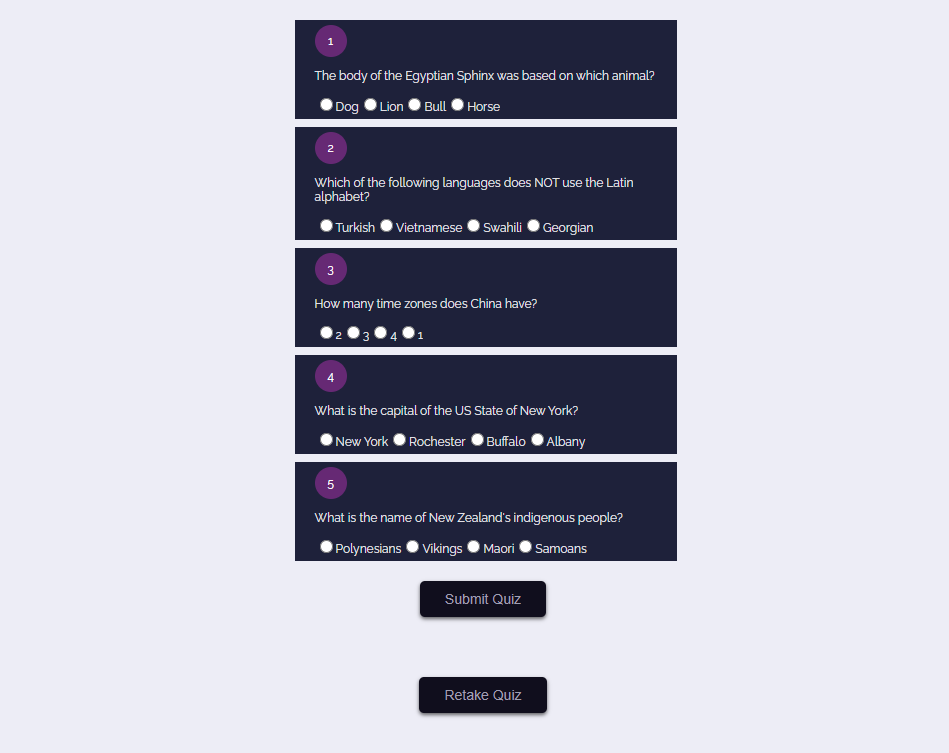

<h1 align="center">Quiz App</h1>

<div align="center">
   Solution to <a href="http://classvisa.com" target="_blank">Classvisa.com</a> core Javascript bootcamp Assignment
</div>

<div align="center">
  <h3>
    <a href="https://smtoyedeji.github.io/geographyQuizApp/">
      Live Website
    </a>
    <span> | </span>
    <a href="https://github.com/smtoyedeji/geographyQuizApp.git">
      Github Repo
    </a>
  </h3>
</div>


<!-- TABLE OF CONTENTS -->

## Table of Contents

- [Overview](#overview)
  - [User Story](#user-story)
  - [Built With](#built-with)
- [Features](#features)
- [How to use](#how-to-use)
- [Contact](#contact)


<!-- OVERVIEW -->

## Overview



### User Story

- a quiz app to test your knowledge of geography.
- the app will have a opening page where user can select the number of questions to answer from a radio button selection (5, 10, 15, 20) and and also select difficulty level.
- depending on the user selection, an fetch API call is sent to opentbd API
- each questions will have a list of options with only one option as the correct answer.
- the score for the quiz is displayed after the submit quiz button is clicked.
- user can take another using the "retake quiz".


### Built With

- HTML
- CSS
- Javascript
- [Open Trivia API](https://opentdb.com/)


## Features

This application was created as part of [ClassVisa](https://classvisa.com) core Javascript bootcamp challenge. The challenge was to build a Quiz App.

## How To Use

To clone and run this application, you'll need [Git](https://git-scm.com) and [Node.js](https://nodejs.org/en/download/) (which comes with [npm](http://npmjs.com)) installed on your computer. From your command line:

```bash
# Clone this repository
$ git clone https://github.com/smtoyedeji/geographyQuizApp.git

# Run the app
$ npm start
```


## Contact

- GitHub [@smtoyedeji](https://github.com/smtoyedeji)
- Twitter [@oyedeji__](https://twitter.com/oyedeji__)
